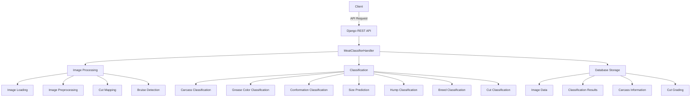

# ECOIA Classifier

[](https://www.python.org/downloads/release/python-3110/)
[](https://www.djangoproject.com/)
[](https://opencv.org/)

## Table of Contents
- [Overview](#overview)
- [Features](#features)
- [Project Architecture](#project-architecture)
- [Directory Structure](#directory-structure)
- [System Components](#system-components)
- [Installation](#installation)
- [Usage](#usage)
- [Dependencies](#dependencies)
- [Configuration](#configuration)
- [Development Best Practices](#development-best-practices)
- [Release Notes](#release-notes)
- [License](#license)
- [Contributors](#contributors)
- [Deployment](#deployment)

## Overview
ECOIA Classifier is a Django-based application for automated meat classification using computer vision and machine learning. The system analyzes images of meat carcasses to detect and classify various attributes such as cuts, bruises, grease color, conformation, size, hump, and breed.

## Features
- **Carcass Classification**: Identifies and classifies meat carcasses
- **Bruise Detection**: Detects and classifies bruises on meat
- **Cut Mapping**: Maps different cuts of meat on the carcass
- **Grease Color Classification**: Analyzes and classifies the color of grease
- **Conformation Classification**: Classifies the conformation of the carcass
- **Size Prediction**: Measures and predicts the size of the carcass
- **Hump Classification**: Detects and classifies humps
- **Breed Classification**: Identifies the breed of the animal
- **Stamp Detection**: Detects stamps on the meat
- **Watermarking**: Adds watermarks to processed images

## Project Architecture

> **Note for PyCharm users**: PyCharm's built-in Markdown previewer doesn't natively support Mermaid diagrams. To view the diagram, you can:
> - Install the "Markdown Navigator Enhanced" plugin for PyCharm
> - View this README on GitHub where Mermaid is supported
> - Use an online Mermaid editor like [Mermaid Live Editor](https://mermaid.live)



## Directory Structure

The project follows a modular and organized directory structure to ensure maintainability and scalability:

```
ecoia-classifier/
├── apps/                  # Django applications
│   ├── integrator/        # Integration with external systems
│   ├── meat_classifier/   # Core meat classification app
│   └── model_updater/     # Model update management
├── base/                  # Base configurations and classes
├── data/                  # Data-related files
│   ├── docs/              # Documentation
│   ├── images/            # Image resources
│   ├── install/           # Installation scripts
│   ├── logs/              # Log files
│   ├── migrations/        # Database migrations
│   ├── models/            # ML models for different classification tasks
│   └── scripts/           # Utility scripts
├── logs/                  # Application logs
├── src/                   # Source code
│   ├── controller/        # Business logic and database operations
│   ├── enum/              # Enumeration classes
│   ├── handler/           # Request handlers
│   ├── job/               # Background jobs
│   ├── ml/                # Machine learning components
│   │   ├── classifier/    # Classification models
│   │   ├── loader/        # Model loaders
│   │   └── shape_predictor/ # Shape prediction models
│   └── utils/             # Utility functions
└── manage.py              # Django management script
```

### Why This Structure?

1. **Separation of Concerns**: Each directory has a specific responsibility, making the codebase easier to navigate and maintain.
2. **Modularity**: Components are organized into modules that can be developed and tested independently.
3. **Scalability**: The structure allows for easy addition of new features and components without disrupting existing code.
4. **Maintainability**: Clear organization makes it easier for new developers to understand the codebase.
5. **Django Integration**: Follows Django best practices while extending with custom organization for ML components.

## System Components

### Django Apps
- **meat_classifier**: Core app for meat classification
- **integrator**: Handles integration with external systems
- **model_updater**: Manages model updates

### Core Components
- **Controllers**: Handle database operations and business logic
- **Handlers**: Process requests and coordinate classification tasks
- **Utils**: Utility functions for image processing and classification
- **ML Models**: Various machine learning models for different classification tasks

## Installation

### Prerequisites
- Python 3.11
- MySQL database
- OpenBLAS (for numerical operations)
- Build essentials and development tools

### Installation Steps

1. Clone the repository:
```bash
git clone https://github.com/your-organization/ecoia-classifier.git
cd ecoia-classifier
```

2. Run the installation script:
```bash
cd data/install
chmod +x install.sh
./install.sh
```

3. Configure the database:
   - Create a `.env` file in the project root with the following variables:
   ```
   DB_USER=your_db_user
   DB_PASSWORD=your_db_password
   DB_HOST=your_db_host
   DB_PORT=your_db_port
   DB_DATABASE=your_db_name
   ```

4. Run migrations:
```bash
python manage.py migrate
```

5. Start the development server:
```bash
python manage.py runserver
```

## Usage

### API Endpoints

#### Classify Meat
```
POST /api/classify/<classifier_suite>/
```

Example request:
```json
{
  "image_id": "123",
  "image_path": "/path/to/image.jpg"
}
```

Example response:
```json
{
  "status": "success",
  "message": "Classification completed successfully"
}
```

## Dependencies

### Base Dependencies
- Django 4.2.6
- Django REST Framework 3.13.1
- OpenCV 4.9.0.80
- NumPy 1.26.1
- Pillow 10.3.0
- scikit-learn 1.5.0
- dlib 19.24.2
- MySQL client libraries
- Various utility libraries (tqdm, pandas, imutils, etc.)

### PyTorch Dependencies
- torch
- torchvision
- torchaudio

### YOLO Dependencies
- ultralytics 8.1.23

## Configuration

The system is highly configurable with various modules that can be enabled or disabled through the configuration system. Configuration is stored in the database and can be accessed through the `ConfigurationStorageController`.

## Development Best Practices

To maintain code quality and ensure a smooth development process, we follow these best practices:

### Code Quality
1. **PEP 8 Compliance**: Follow Python's PEP 8 style guide for consistent code formatting.
2. **Documentation**: Document all classes, methods, and complex logic with docstrings.
3. **Type Hints**: Use Python type hints to improve code readability and catch type-related errors.
4. **Code Reviews**: All code changes should be reviewed by at least one other developer.

### Version Control
1. **Branching Strategy**: Use feature branches for development and merge to main/master only after review.
2. **Commit Messages**: Write clear, descriptive commit messages that explain the purpose of changes.
3. **Pull Requests**: Create detailed pull requests that describe the changes, their purpose, and any testing performed.

### Testing
1. **Unit Tests**: Write unit tests for all new functionality.
2. **Integration Tests**: Ensure components work together correctly with integration tests.
3. **Test Coverage**: Aim for high test coverage, especially for critical components.
4. **Automated Testing**: Run tests automatically in CI/CD pipelines.

### Machine Learning
1. **Model Versioning**: Version control ML models and track their performance metrics.
2. **Data Validation**: Validate input data before processing to ensure quality.
3. **Model Evaluation**: Regularly evaluate model performance and retrain as needed.
4. **Explainability**: Document model decisions and ensure they can be explained.

### Security
1. **Environment Variables**: Store sensitive information in environment variables, not in code.
2. **Input Validation**: Validate all user inputs to prevent injection attacks.
3. **Authentication**: Implement proper authentication for all API endpoints.
4. **Authorization**: Ensure users can only access resources they're authorized for.

### Performance
1. **Profiling**: Regularly profile code to identify performance bottlenecks.
2. **Optimization**: Optimize critical paths for better performance.
3. **Caching**: Use caching strategies to reduce redundant computations.
4. **Asynchronous Processing**: Use asynchronous processing for long-running tasks.

## Release Notes

### Version 1.14.0 (June 10, 2025)

#### New Features
- Added API endpoint to use models directly with uploaded images
  - New endpoint: `/classifier/use-model/` accepts image uploads via form data
  - Supports specifying which model to use via the `model_name` parameter
  - Returns prediction results in a standardized JSON format

#### Improvements
- Enhanced model prediction handling to support different model types
- Added special handling for classifier models with the `image_classification` parameter

#### Technical Details
- Implemented in `UseModelView` and `UseModelHandler` classes
- Supports all models available in the classifier suite
- Handles nested models (e.g., cuts_classification_models.CUT_TYPE)
- Includes proper error handling and temporary file cleanup

## Deployment

### Production Deployment with PM2

For production environments, we use PM2 to manage the Django application process. The `deploy.sh` script automates this process.

#### deploy.sh

This script handles:

- Deploying specific tagged versions of the application (optional)
- Installing all requirements using pip3.11
- Managing PM2 processes (stopping existing instances and starting new ones)
- Configuring the application to run on the specified port

To deploy the application:

```bash
# Deploy the current branch
chmod +x deploy.sh
./deploy.sh

# Deploy a specific tagged version
./deploy.sh v1.0.0
```

### Deployment Configuration

The deploy.sh script uses the following configuration:

- **Python Version**: Python 3.11
- **Application Name**: ecoia-classifier
- **Default Port**: 8000
- **Host**: 0.0.0.0 (accessible from any IP)

### Monitoring the Deployed Application

After deployment, you can monitor and manage the application using PM2 commands:

```bash
# Check application status
pm2 status

# View application logs
pm2 logs ecoia-classifier

# Restart the application
pm2 restart ecoia-classifier

# Stop the application
pm2 stop ecoia-classifier
